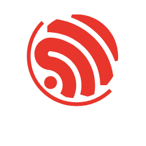
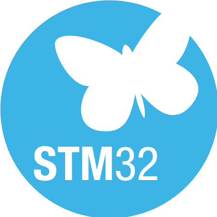
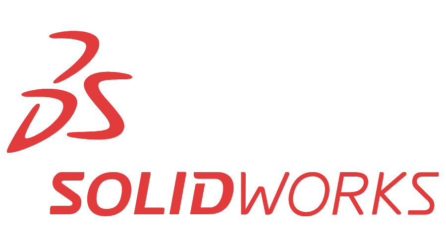

<h1 data-importer="text" align="center">Welcome Comrades</h1>

###

> ❝Never compromise. Not even in the face of Armageddon❞

###

  
  

###

<h3 data-importer="text" align="left">Operator Profile</h3>

###

Mechatronic Engineering student, with strong skills in <b>Electronics Design</b> and <b>Embedded Software Development</b>. Passionate about <b>CAD modeling</b> and <b>software development</b>. In my free time, I enjoy solving problems on  <a href="https://www.codewars.com/users/gorramin">@Codewars</a> and doing pull-ups.

###

<h3 data-importer="text" align="left">Technical Arsenal</h3>

###

  
  
  
  
  
  
  
  
  
  
   
  
  
  
  
  
  
  
  
   
  
  
  
  

###

<h3 data-importer="text" align="left">Active Mission</h3>

###

- Developing [Analog Calibrator](https://github.com/gorramin/analog-calibrator) — an embedded hardware project for generating 0–10V and 4–20mA signals with a custom PCB.

